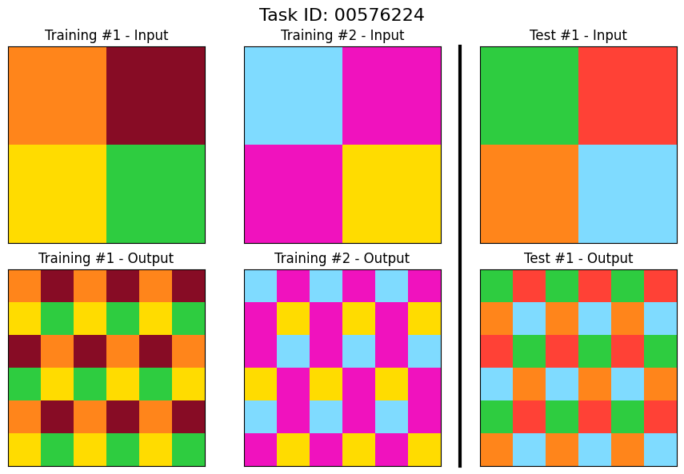

# ARC-2024
This is a repository that takes the winning solution for ARC-2024 and strip down the code to the absolutely minimum working parts. Simply run through `simplified.ipynb`



## General Tips

### Installation
1. Install Nvidia Drivers: 
2. Install CUDA: 
3. Install pytorch: 
4. Install requirements.txt `pip3 install -r requirements.txt`
4. Download Model: `./download_model.sh`

### htop for CUDA
```bash
watch -n0.1 nvidia-smi
```

### For Ubuntu
In Ubuntu it will be often that we want to use the integrated graphics for our OS UI, and use our dedicated graphics for CUDA only. To do this there is a 2019 guide, or a command that Ubuntu provides:

- Ubuntu command: `sudo prime-select on-demand`
- 2019 Guide: [link](https://gist.github.com/alexlee-gk/76a409f62a53883971a18a11af93241b)

### Uninstalling CUDA

```
sudo apt-get --purge remove cuda
sudo apt-get autoremove
dpkg --list |grep "^rc" | cut -d " " -f 3 | xargs sudo dpkg --purge
```
